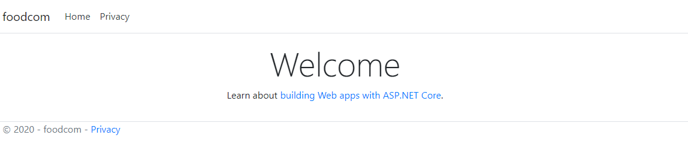

<!--
*** Thanks for checking out the Best-README-Template. If you have a suggestion
*** that would make this better, please fork the repo and create a pull request
*** or simply open an issue with the tag "enhancement".
*** Thanks again! Now go create something AMAZING! :D
-->


<!-- PROJECT SHIELDS -->
<!--
*** I'm using markdown "reference style" links for readability.
*** Reference links are enclosed in brackets [ ] instead of parentheses ( ).
*** See the bottom of this document for the declaration of the reference variables
*** for contributors-url, forks-url, etc. This is an optional, concise syntax you may use.
*** https://www.markdownguide.org/basic-syntax/#reference-style-links
-->
[![Contributors][contributors-shield]][contributors-url]
[![Forks][forks-shield]][forks-url]
[![Stargazers][stars-shield]][stars-url]
[![Issues][issues-shield]][issues-url]
[![MIT License][license-shield]][license-url]
[![LinkedIn][linkedin-shield]][linkedin-url]


<!-- PROJECT LOGO -->
<br />
<p align="center">
  <a href="https://github.com/madmorrison/foodcom">
    
  </a>

  <h3 align="center">Foodcom</h3>

  <p align="center">
    A user friendly e-commerce platform.
    <br />
    <a href="https://github.com/madmorrison/foodcom"><strong>Explore the docs »</strong></a>
    <br />
    <br />
    <a href="https://github.com/madmorrison/foodcom">View Demo</a>
    ·
    <a href="https://github.com/madmorrison/foodcom/issues">Report Bug</a>
    ·
    <a href="https://github.com/madmorrison/foodcom/issues">Request Feature</a>
  </p>
</p>


<!-- TABLE OF CONTENTS -->
<details open="open">
  <summary>Table of Contents</summary>
  <ol>
    <li>
      <a href="#about-the-project">About The Project</a>
      <ul>
        <li><a href="#built-with">Built With</a></li>
      </ul>
    </li>
    <li>
      <a href="#getting-started">Getting Started</a>
      <ul>
        <li><a href="#prerequisites">Prerequisites</a></li>
        <li><a href="#installation">Installation</a></li>
      </ul>
    </li>
    <li><a href="#usage">Usage</a></li>
    <li><a href="#roadmap">Roadmap</a></li>
    <li><a href="#contributing">Contributing</a></li>
    <li><a href="#license">License</a></li>
    <li><a href="#contact">Contact</a></li>
    <li><a href="#acknowledgements">Acknowledgements</a></li>
  </ol>
</details>


<!-- ABOUT THE PROJECT -->
## About The Project



Easy to use, clean interfaced web application.

### Built With

- [NodeJS 12](https://nodejs.org)
- [.NET core SDK 5.0.100](https://dotnet.microsoft.com/download)


<!-- GETTING STARTED -->
## Getting Started

To get a local copy up and running follow these simple example steps.

### Prerequisites

This is an example of how to list things you need to use the software and how to install them.
* npm
  ```sh
  npm install npm@latest -g
  ```

### Installation

1. Clone the repo
   ```sh
   git clone https://github.com/madmorrison/foodcom.git
   ```
2. Install NPM packages
   ```sh
   npm install
   ```


<!-- USAGE EXAMPLES -->
## Usage

Use this space to show useful examples of how a project can be used. Additional screenshots, code examples and demos work well in this space. You may also link to more resources.

_For more examples, please refer to the [Documentation](docs/)_


<!-- ROADMAP -->
## Roadmap

See the [open issues](https://github.com/madmorrison/foodcom/issues) for a list of proposed features (and known issues).


<!-- CONTRIBUTING -->
## Contributing

Contributions are what make the open source community such an amazing place to be learn, inspire, and create. Any contributions you make are **greatly appreciated**.

1. Fork the Project
2. Create your Feature Branch (`git checkout -b feature/AmazingFeature`)
3. Commit your Changes (`git commit -m 'Add some AmazingFeature'`)
4. Push to the Branch (`git push origin feature/AmazingFeature`)
5. Open a Pull Request


<!-- LICENSE -->
## License

Distributed under the MIT License. See `LICENSE` for more information.


<!-- CONTACT -->
## Contact

Tyler Morrison - [@madmorrison_](https://twitter.com/madmorrison_) - tmorrison4539@gmail.com

Project Link: [https://github.com/madmorrison/foodcom](https://github.com/madmorrison/foodcom)


<!-- ACKNOWLEDGEMENTS -->
## Acknowledgements
* [GitHub Emoji Cheat Sheet](https://www.webpagefx.com/tools/emoji-cheat-sheet)
* [Img Shields](https://shields.io)
* [Choose an Open Source License](https://choosealicense.com)
* [GitHub Pages](https://pages.github.com)
* [Animate.css](https://daneden.github.io/animate.css)
* [Loaders.css](https://connoratherton.com/loaders)
* [Slick Carousel](https://kenwheeler.github.io/slick)
* [Smooth Scroll](https://github.com/cferdinandi/smooth-scroll)
* [Sticky Kit](http://leafo.net/sticky-kit)
* [JVectorMap](http://jvectormap.com)
* [Font Awesome](https://fontawesome.com)


<!-- MARKDOWN LINKS & IMAGES -->
<!-- https://www.markdownguide.org/basic-syntax/#reference-style-links -->
[contributors-shield]: https://img.shields.io/github/contributors/madmorrison/foodcom.svg?style=for-the-badge
[contributors-url]: https://github.com/madmorrison/foodcom/graphs/contributors
[forks-shield]: https://img.shields.io/github/forks/madmorrison/foodcom.svg?style=for-the-badge
[forks-url]: https://github.com/madmorrison/foodcom/network/members
[stars-shield]: https://img.shields.io/github/stars/madmorrison/foodcom.svg?style=for-the-badge
[stars-url]: https://github.com/madmorrison/foodcom/stargazers
[issues-shield]: https://img.shields.io/github/issues/madmorrison/foodcom.svg?style=for-the-badge
[issues-url]: https://github.com/madmorrison/foodcom/issues
[license-shield]: https://img.shields.io/github/license/madmorrison/foodcom.svg?style=for-the-badge
[license-url]: https://github.com/madmorrison/foodcom/blob/master/LICENSE
[linkedin-shield]: https://img.shields.io/badge/-LinkedIn-black.svg?style=for-the-badge&logo=linkedin&colorB=555
[linkedin-url]: https://www.linkedin.com/in/tyler-morrison-379139106/
[product-screenshot]: images/screenshot.png
